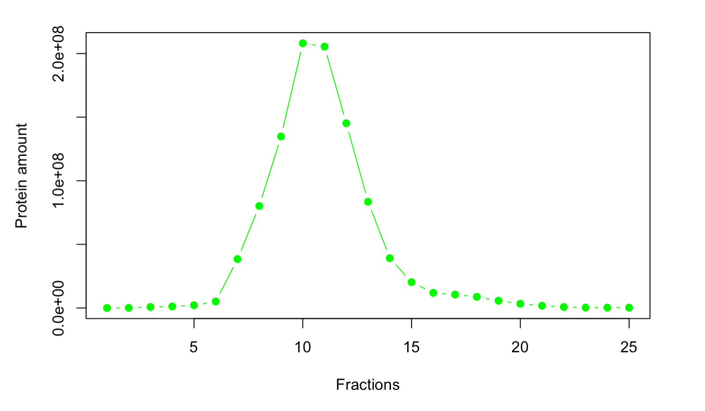
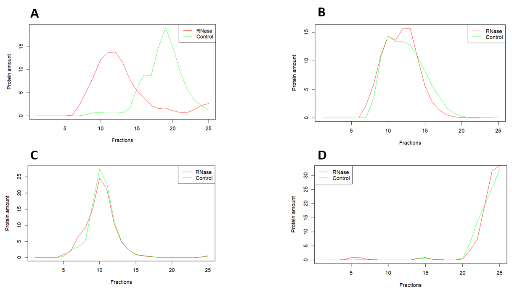

```{r setup, include=FALSE}
knitr::opts_chunk$set(echo = TRUE)
```

# Final Report


# 1. Introduction

Cancer, neurological diseases and muscular atrophy - What do these diseases have in common? 
All of them include RNA-binding proteins. RNA-binding proteins (RBP) are proteins that bind RNA and form ribonucleoprotein particles. They are involved in a number of processes like translation, alternative splicing, RNA editing and chemical modification as well as protein modification. RBPs belong to the RNA-dependent proteins (RDP) togehter with RBP-binding proteins. These RBP-binding proteins bind RBPs when they assemble with RNA. Their complex interactions are crucial for cellular functions and therefore it is of importance to identify RDPs.


## 1.1 Summary of experiment
To identify RDPs a proteom-wide screen was conducted with mass-spectometry. HeLa S3 cels in different cell cycle stages were lysed (Fig. 1). The cell lysate was split into a control and an RNase gropup. The RNase group was treated with RNase which causes the degradation of RNase. RBPs can no longer bind to RNA and RBP-binding proteins to RBPs. The control group did not receive any further treatment and therefore all RNA and RDPs interact. The cell lysate was transferred onto a sucrose density gradient. After ultra centrifugation the RNA-protein complexes or proteins alone will end up in one of 25 fractions depending on their molecular weight. A heavy RNA-protein complex will travel further and land in a higher fraction than a single protein from the RNase treatment. This would create a left shift and is expected to happen for RDPs.


## 1.2 Goals
The main goal is to automatically identify RDPs on the basis of the fraction shift between control and RNase treatment. 

# 2. Materials and Methods

## 2.1 Description of the Dataset
The dataset consists of 4765 rows which represent different proteins and 150 columns. Those include 3 replica for each of the 25 fractions for control and RNase treatment (3 x 25 x 2 = 150 columns). For every protein the protein amount in a certain fraction is given in arbitrary units.

## 2.2 T-tests
The t-test is a statistical hypothesis test. It follows the student's t-distribution under the null hypothesis. It can be used to identify whether two sets of data are significantly different when compared to each other. A two-sampled t-test checks if the means of the two data sets are equal.The p-value computed is the probability of obtaining a more extreme value of the test statistics of the null hypothesis is valid. To determine when the probability is very low or high a significance level alpha has to be defined. If the p-value is smaller than the significance level the null hypothesis can be rejected and the observed effect is significant. If the p-value is larger than de significance level this means that the effect is not sufficient to reject the null hypothesis and there can be no significant effect seen.The standard value for alpha is 0.05. Furthermore it is important to checked the false discovery rate. For this the Benjamini-Hochberg procedure can be used. It controls that some small p-values happen by chance and this could lead to an incorrect rejection of the null hypothesis. It therefore reduces Type 1 errors. ^[1]

## 2.3 K-means
K-means is a method for clustering that aims to structure *n* observations into *k* clusters. Each observation *n* is assigned to the cluster with the smallest eucledian distance to the clusters centroid. After the initial cluster is assigned to each observation, new centroids are set up to have the smallest distance to all its observations. To quantify which amounts of clusters *k* is the best the silhouette or elbow method can be used ^[2].
The silhouette method calculates the distance of every point to its own and the neighbouring cluster (smallest distance of point i to a point that is not a member of its own cluster). Every point obtains a silhouette value between -1 and 1. 1 meaning that the observation fits perfectly into its cluster and -1 meaning that it would be more appropriate to place it in a neighbouring cluster. By changing the amounts of clusters, the overall mean of the silhouette value of all points change. The higher this mean is, the more accurate the clustering works ^[3]. 
The elbow method calculates the Within-Cluster Sum of Squared Errors (WSS) for different values of k. When plotting the WSS against the amount of clusters *k* a declining curve is produced. By choosing the *k* for which the WSS first starts to diminish you receive the optimal amount of clusters .


## 2.4 Linear Regression
Linear regression is a method to model the linear relashionship between a scalar and an explanatory variable. When there is more than one scalar variable the process is called multiple linear regression. The relationship is modeled using a linear predictor function "the line of best fit". Therefore the explanatory variable can be estimated by using only existing parameters. The parameters of the regression line are estimated using the least-square method to minimize the sum of squares of the deviations. Since the estimated value and the real value do not generally coincide their difference is called residuals. The correlation between the estimated parameter and the residuals should be close to zero. The residuals should also have a mean value of zero and be normally distributed.
To determine the quality of a linear model the F-test is applied. The F-test is a statistical test that compares the linear model with test statistic that has an F-distribution under the null-hypothesis. The null model uses the equation *Y = b<sub></sub>* with *b<sub>0</sub> = mean(Y)*. While the full model uses the determined parameters *Y = b<sub>0</sub> + b<sub>1</sub>X* for a simple linear regression ^[4].


# 3. Results

# 3.1 Data Clean Up and Normalization 
Clean Up of the raw data is needed for the following analysis. 
First we split our dataset into two dataframes containing only the control and RNase group. Those were split further into three subtables representing the three reps. A protein was deleted from control and RNase when it had no counts in at least one rep. Eight proteins were deleted, becuase they had at least one all zero row in one rep.

## 3.1 Normalization 
Goal of the normalization is to make the three different reps more similar by applying statistical and mathematical functions.

a) Repwise Normalization 


For simpler calculation we created subtables seperately for control and RNase containing only one fraction with all three reps (for both control and RNase group 50 subtables were created). For every subtable the mean over all the proteins for every rep from one fraction was calculated, creating 3 mean values in for each of the 50 subtables. 
The function *smallest diff* was created to find the two reps for every individual fraction with the smallest difference of their mean values. The mean value of these two reps over all the proteins from one fraction was determined. The normalization factors for every fraction for each rep was calculated by dividing the mean from the most similar two reps by the individual means of one fraction for each rep (for each of the 50 subtables containing one fraction with three reps, three normalization factors were determined). By multiplying all the values of one fraction of one rep with its individual normalization factor, we received the normalized values for all reps and for both control and RNase group.
When comparing the unnormed values with the normalized values by summing up all the proteins of all fraction for each rap, it is noticably how the reps have been statistically adjusted. 


b) Fraction-wise Normalization - Scaling
After creating the vectors with the normed values for each fraction, we were ready to scale our data. We created a for loop for each sample which first sums up the values of each fraction and sets this sum to 100. We then calculated the proportion for each protein amount in comparison to the scaled sum of the whole row. This gave us values of protein amount between 1 and 100 and a sum of 100 for the sum of a protein over all fractions. This facilitates the comparison of our values between the reps.

## 3.2 Reproducibility
The three reps for control and RNAse group were adjusted during normalization. Nontheless, it is possible that they differ too much in order to be used in further analysis. Therefore we examined the reproducibility of the reps with correlation. First the normalized data was transformed so that the columns consist of proteins and rows of the different protein amounts in each fraction. We created the function *low.cor* that first calculates the pearson correlation over all fractions of each protein of two reps. It returns only the column numbers of proteins which reps have a correlation coefficient beneath 0.7. By applying *low.cor* six times (rep1 & rep2, rep1 & rep3, rep2 & rep3 for control and RNase) we could create a dataframe that contains only proteins with low correlation and includes how often a protein did not correlate well. 
Proteins that have a low correlation coefficient two or three times (three times meaning that no rep correlates well) are deleted.

## 3.3 Smoothing the Curve
To smoothen the curve, we created two for loops. The first loop goes through each row so that the second for loop is applied to each protein. The second loop takes fraction i and calculates the mean of fraction i, i-1 and i+1. This mean will then replace the original value of the protein amount in fraction i. Since there is no fraction before fraction 1 and no fraction after fraction 25, the second loop is only applied to fraction 2-24 for every protein of each rep. 
We will still have 6 vectors containing every protein and its 25 fractions, but these values will now be more similar to its neighboring values due to the smoothing method we have applied.
This step would be essential before fitting the curve to a Gaussian curve for certain proteins. In Figure 3 and 4 the result of smoothing can be seen for the protein AHNK_HUMAN. Individual fractions are corrected and the curve looks more familiar to the Gaussian curve.



# 4. Maxima  
The relevance of the maxima for the definition of a Protein as one that binds to RNA lies in the premise, that the peaks of protein seen in a certain fraction within our control group will then have a peak shift once the same mass spectrometry has been performed in the presence of RNase. Thus, it is essential that we are able to find the maxima of each and every single protein, so that we can later on compare these values.

## 4.1 Identification of global Maxima
With our now smoothened data, we can now create a function that defines our maxima and apply it, with the goal of creating a new dataframe consisting of just the fractions where the global maxima for control and RNase can be found. 

We defined a function that takes a protein from our normalized dataframes and goes through each fraction, comparing the protein amount in it to a m-number of values before and m-number of values after the to be determined fraction (m being an adjustable parameter, which allows for heightened robustness against outliers and fluctuation).

```{r Definition of the peak-finding function, include = TRUE}
find_peaks <- function(x, m=50) { #In this case m was set to m=50, since for our first 
  #run we mainly want to observe the global maxima of each protein
  peaks_pos <- sapply(1:length(x), FUN = function(i) { #In "peaks_pos" all values are 
    #saved of positions where the function has found a peak in, while iterating over 
    #all fractions of all proteins
    if (x[i] == 0) return (numeric(0)) #If any value found is equal to 0, then said 
    #value will be returned as an empty one
    lborder <- max(c(1, i-m)) #This part of the function makes sure, we stay within 
    #our borders. While the function is iterating through the values it, it will do 
    #so and either return the value of the position it finds itself at or, in the most 
    #extreme of cases, return the value "1"
    rborder <- min(c(i+m, length(x))) #Similarly to the lborder, rborder makes sure 
    #we stay within our borders, but on the other extreme (length(x) = 25)
    if(all(x[lborder:rborder] <= x[i])) return(i) else return(numeric(0)) #This part of 
    #the function will return the position of a maxima, in the case that when comparing 
    #its neighboring values of lborder and rborder, the maxima "i" is great or equal; 
    #if not, it will return an empty value and continue with the next position
    } )
  return(unlist(peaks_pos)) #Finally, we return the unlisted list of "peaks_pos"
}
```

## 4.2 Finding signifcant peaks
In the following step, we created a second part of the function, that should take the values out of the "peaks_pos" list or peaks positions list, and see if the protein amount in said peaks was higher than the defined threshold. If the values in "peaks_pos" are higher than the threshold, they are put into the peaks list. 

Our intent is to just use the global maxima for the evaluation of the shifts, so by the end, we only had one peak, whenever the function was applied on a dataframe.



## 5.1 Clustering with K-means 
K-means was used to identify proteins with similar characteristics in their shifts between control and RNase. We chose different cluster amounts from two to six. To determine which amount of clusters is the best, we used the silhouette and elbow method. 
For our proteins the highest mean silhouette value is 0.5255658 for k=5.


## 5.2 Ttest to compute pvalues

Before coding the actual function to compute our ttest, we firstly created two empty vectors. One to put the pvalues in and one for the significant proteins. Afterwards we created a for loop that firstly creates a vector each for contol and RNase that contains the peaks of each protein. 
As we encountered some problems with essentially constant values we used an if function to set the pvalue for proteins, which either have a duplicate in the control or rnase group, to 1. We set this value to 1 as this shows that there is absolutely no difference between the values which indicates that there cannot be a significant shift. This did sort out 78 proteins containing constant values and therefore we were then able to compute the two-sided ttest for all other proteins that differ in the amount of the six replicates. The computed pvalue was then adjusted using the method of Benjamini, Hochberg and Yekutiel to decrease the false discovery rate This left us with an amount of 1921 proteins that did show an significant shift.

## 5.2 Linear Regression 

Our idea for model 1 was to use the correlation between the mean values of control and RNase to predict the amount of fractions for a shift for each protein. We used 90% of all proteins to create the linear regression. The p-value of the F statistic is 2.2*10-16, meaning that the null hypothesis could be rejected. For b0 we received 8.27 and for b1 -8.14. When looking at these numbers it is clear that the model does not work properly. It does not predict a shift of more than one fraction, but there are a number of proteins that have a shift of 2 or more fractions. This is why we rejected this model.
This is why we created a second model which predicts whether there is a shift or not. A matrix containing the difference between the maxima fractions of control and RNase was converted to contain 1 when there is a shift and 0 when there is no shift. Model 2 also uses the correlation between control and RNase. The p-value of the F statistic is again smaller than 2.2*10^-16, b0 = 1.09 and b1 = -0.727. Then we tested the model with the other 10% of our proteins. A dataframe was created containing the real shift (0 or 1) and the predicted shift. Since the predicted shift is a number between 0 and 1, we set a threshold of 0.2. If the predicted shift is 0.2 or higher we estimate a shift and assign the number 1. If the predicted shift is smaller than 0.2 we estimate that this protein will not shift and assign the number 0. The false positive rate is 10,8% and false negative rate is 41,5%. Out of 466 proteins, 387 proteins were assigned correctly which means that model 2 predicted 83% of proteins correctly.

^[1] B. L. Welch: The significance of the difference between two means when the population variances are unequal. In: Biometrika. Band 29, 1938, S. 350–362.
^[2] MacKay, David (2003). "Chapter 20. An Example Inference Task: Clustering" (PDF). Information Theory, Inference and Learning Algorithms. Cambridge University Press. pp. 284–292.
^[3] Peter J. Rousseuw (1987). "Silhouettes: a Graphical Aid to the Interpretation and Validation of Cluster Analysis". Computational and Applied Mathematics. 20: 53–65.
^[4]David A. Freedman (2009). Statistical Models: Theory and Practice. Cambridge University Press.


```{r pressure, echo=FALSE}

```


